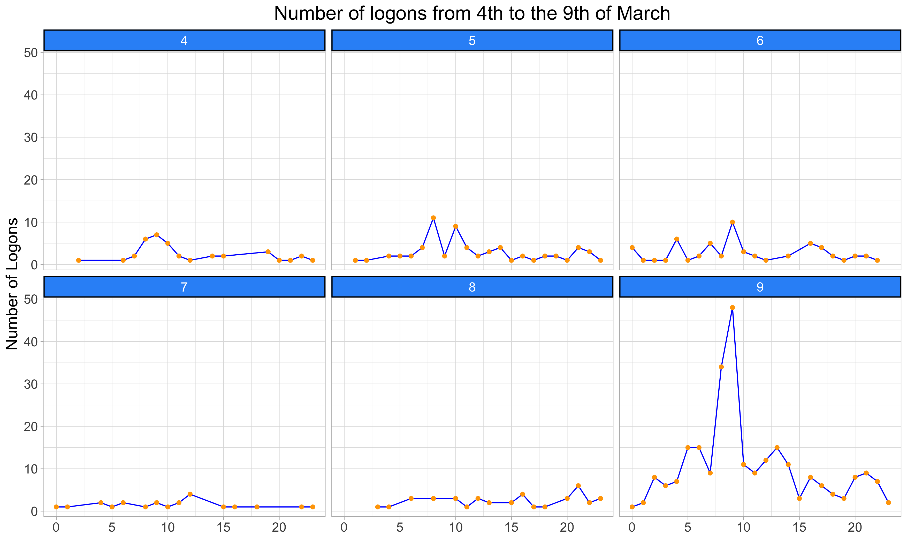

---
DeX Internal Benchmark
Toufik SWAR
31/01/2020
---

This is a R Notebook to perform hard reset Analysis, based on Data extracted from Nexthink Finder.

### Installation

In order to run the code and generate the graph, you will need RStudio. 

It also requires the tidyverse package, as well as the lubridate package (in order to manage time series).

To install tidyverse, run the below command in the R Console
``` r
install.packages("tidyverse")
install.packages("lubridate")
```
<br/><br/>

### Usage

In RStudio, go to the *Hard_Reset_Analysis.Rmd* file and click **Preview**. You can use MAJ + CMD + K (if you run on Mac OS -  if you use Windows, I am sorry...)

It will allow you to generate the following graphs:

<br/><br/>

**Cool graph 1** 
<center>  </center>

<br/><br/>

**Cool graph 2**
<center>  </center>

<br/><br/>

**Cool graph 3**
<center>  </center>

<br/><br/>

**Cool graph 4**
<center>  </center>

<br/><br/>

**Cool graph 5**
<center>  </center>

<br/><br/>

**Cool graph 6**
<center>  </center>

<br/><br/>

**Cool graph 7**
<center>  </center>

<br/><br/>

**Cool graph 8**
<center>  </center>

<br/><br/>

**Cool graph 9**
<center>  </center>

<br/><br/>

**Cool graph 10**
<center>  </center>

<br/><br/>

**Cool graph 11**
<center>  </center>


### Data
The code comes with sample data that you will find in the *data-raw/samples* folder.

To run this pipelines you will need to run the following investigations (in bold the required fields).

* List of all devices
  * **Device name** 
  * **OS and Architecture** 
  * **Entity** 
  * **Device manufacturer** 
  * **OS Build** 
  * **Device product version**


* List of all devices experiecing hard resets
  * **Device name** 
  * **OS and Architecture** 
  * **Entity** 
  * **Device manufacturer** 
  * **OS Build** 
  * **Device product version**


* Device Errors events last 7 days
  * **Device name** 
  * **Time** 
  * **Error Code**


* Device Warnings events last 7 days
  * **Device name** 
  * **Start time** 
  * **Event info** 
  * **Device name**


* Device Installations events last 7 days
  * **Device name** 
  * **Time of installations** 
  * **Operation type**


Once you get the data save it as a **csv** file.

Don't forget to replace the file name with *your_file_name.csv* in the notebook code to load your data file.
Also put your delimiter, it can be tabulation, coma, semicolon etc. In the example below, it is tabulation (\\t).

```r
df <- read_delim(file = "./data-raw/your_file_name.csv", delim = "\t")
```

<br/><br/>

### Contributing

Pull requests are welcome. For major changes, please open an issue first to discuss what you would like to change.

Any suggestions ? Enhancements ? Reach out :)

<br/><br/>

### Support

For any help, feel free to contact <toufik.swar@nexthink.com>. He is your man.

<br/><br/>
